# 🚀 QueryBridge – React + Firebase Based Submission Platform

**QueryBridge** is a sleek React-based web platform that allows students to submit assignments and doubts in real-time.  
Built with a clean Tailwind CSS UI and powered by Firebase for authentication, Firestore storage, and email notifications.

---

## 📸 Screenshots

> Here's a visual overview of the platform:

<table>
  <tr>
    <td>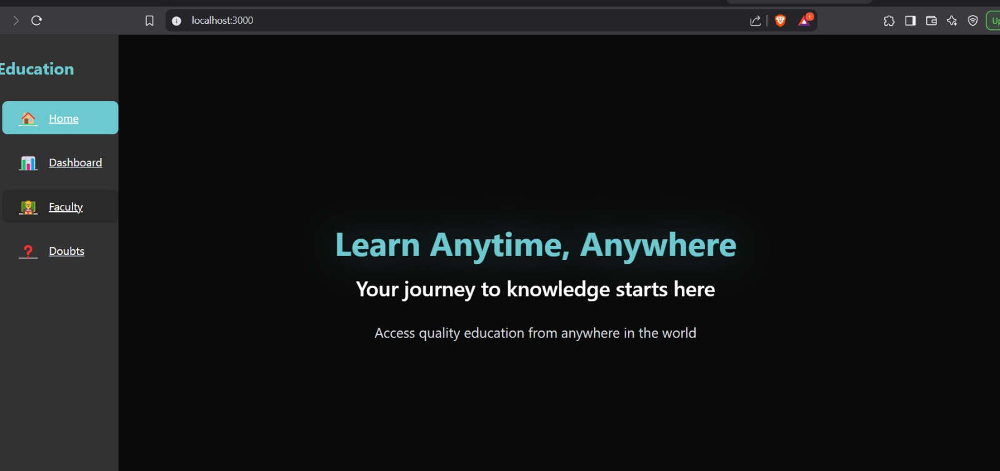</td>
    <td>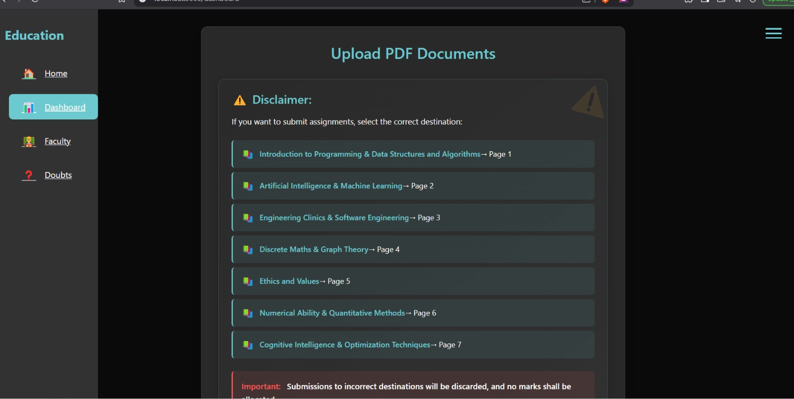</td>
  </tr>
  <tr>
    <td>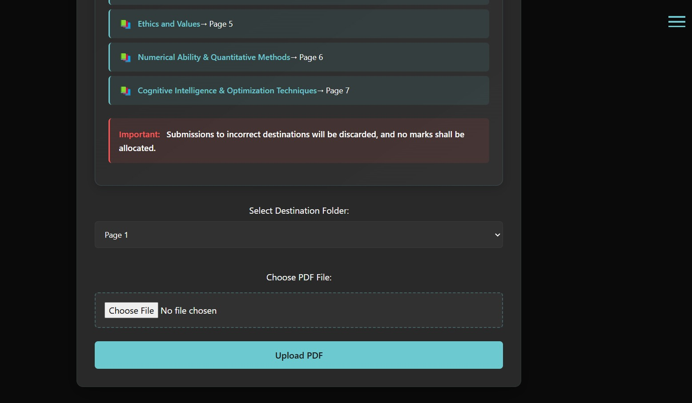</td>
    <td></td>
  </tr>
  <tr>
    <td></td>
    <td>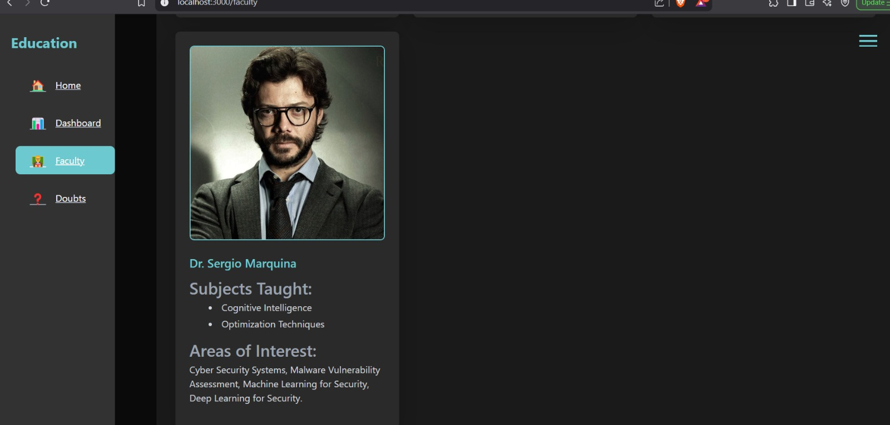</td>
  </tr>
  <tr>
    <td>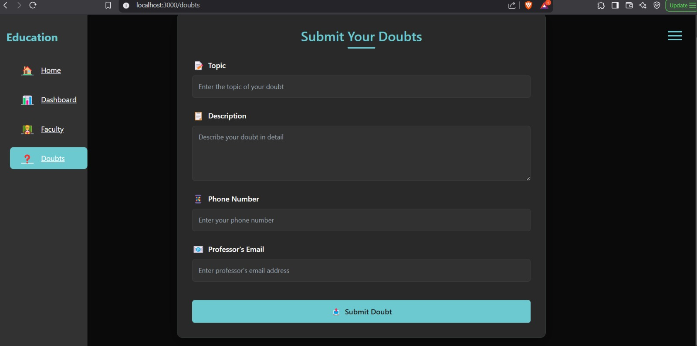</td>
    <td>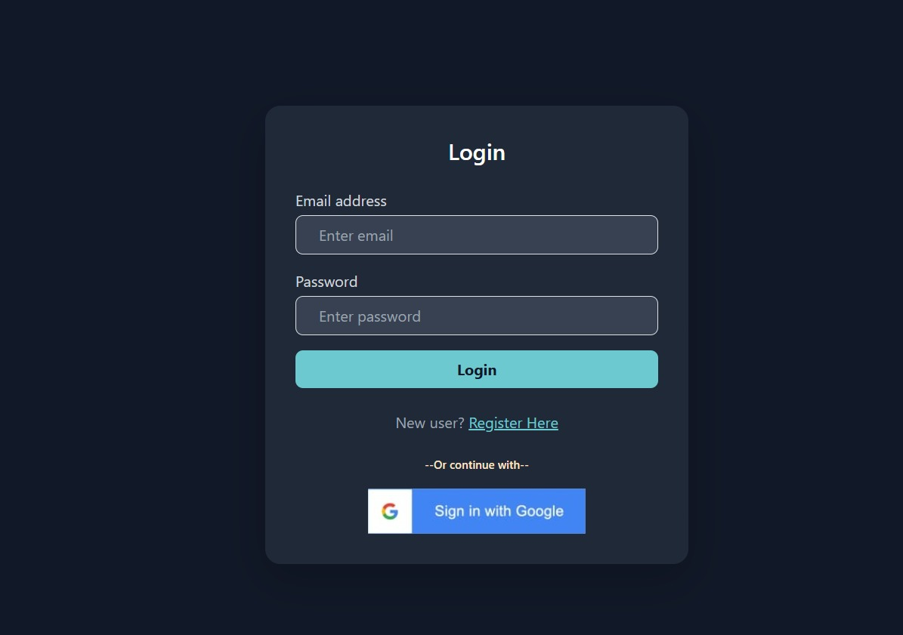</td>
  </tr>
  <tr>
    <td>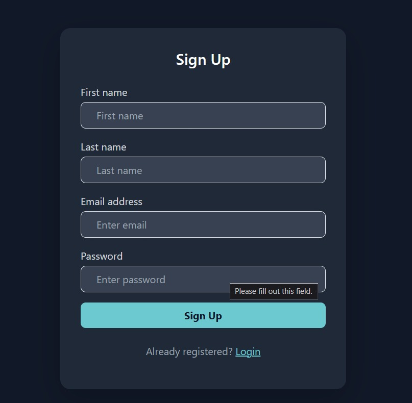</td>
    <td>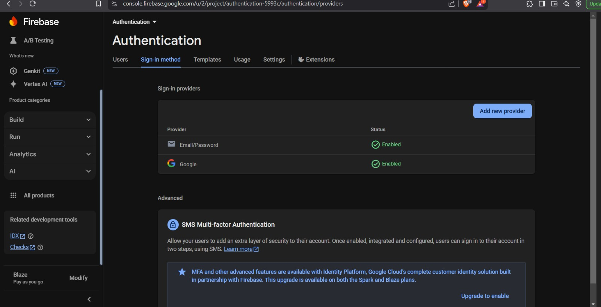</td>
  </tr>
  <tr>
    <td>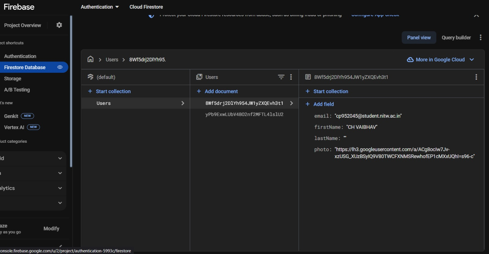</td>
    <td>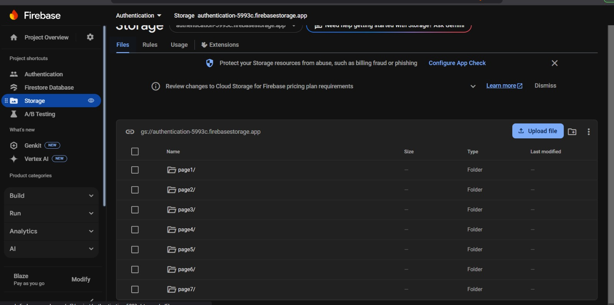</td>
  </tr>
  <tr>
    <td>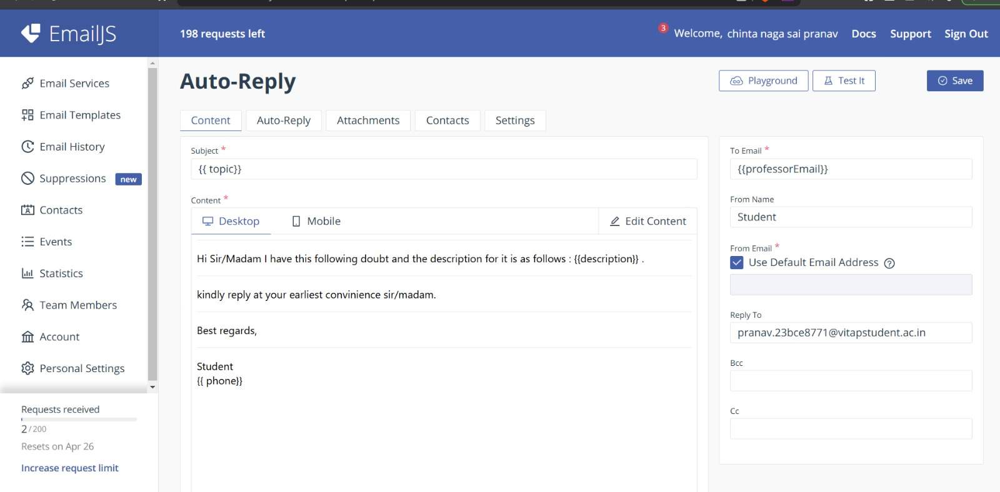</td>
    <td></td>
  </tr>
</table>

_All screenshots are stored locally in the `/public` directory and preview on GitHub._

---

## ✨ Features

- 🔐 Google Sign-In with Firebase Authentication  
- 📤 Assignment and doubt submission by students  
- 📬 Automated email notification to subject teachers  
- 📁 Real-time database with Firebase Firestore  
- 🎨 Beautiful and responsive UI using Tailwind CSS  
- 🔥 Fully client-side rendered with Firebase backend

---

## 🛠️ Tech Stack

- **Frontend:** React  
- **Styling:** Tailwind CSS  
- **Backend & Storage:** Firebase (Auth, Firestore, EmailJS)

---

## 📦 Installation

```bash
# Clone the repository
git clone https://github.com/your-username/querybridge.git
cd querybridge

# Install dependencies
npm install

# Start the development server
npm run dev  # or `npm start` if using CRA
